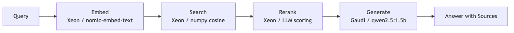
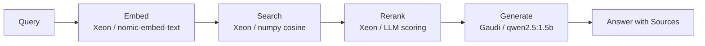

# Build enterprise RAG across the Intel inference continuum

Xeon handles embedding, search, and reranking while Gaudi handles generation in a full RAG pipeline.

## Table of Contents

- [Overview](#overview)
- [Detailed description](#detailed-description)
  - [Architecture diagrams](#architecture-diagrams)
- [Requirements](#requirements)
  - [Minimum hardware requirements](#minimum-hardware-requirements)
  - [Minimum software requirements](#minimum-software-requirements)
  - [Required user permissions](#required-user-permissions)
- [Deploy](#deploy)
  - [Prerequisites](#prerequisites)
  - [Installation](#installation)
  - [Validating the deployment](#validating-the-deployment)
  - [Delete](#delete)
- [Repository structure](#repository-structure)
- [References](#references)
- [Tags](#tags)

## Overview

Enterprise organizations need to build knowledge retrieval systems that provide accurate, source-attributed answers from their document collections. This quickstart deploys a full Retrieval-Augmented Generation (RAG) pipeline across the Intel inference continuum, where Intel Xeon handles embedding, vector search, and reranking while Intel Gaudi accelerates answer generation. AI architects, platform engineers, and DevOps teams can deploy the complete pipeline on Red Hat OpenShift AI and immediately begin indexing documents and querying them with full source attribution and per-step hardware telemetry.

## Detailed description

Retrieval-Augmented Generation reduces hallucination and enables enterprise knowledge base applications by grounding language model responses in retrieved source documents. However, running a full RAG pipeline requires orchestrating multiple compute-intensive steps -- embedding generation, similarity search, relevance reranking, and answer generation -- each with different computational profiles. This quickstart demonstrates how the Intel inference continuum optimizes each step by assigning it to the most appropriate hardware.

The pipeline processes documents through four stages. First, uploaded documents are chunked with configurable overlap (512 tokens, 50-token overlap) and embedded using nomic-embed-text running on Intel Xeon. The resulting vectors are stored in an in-memory numpy-based vector store for cosine similarity search, also on Xeon. When a user submits a query, the system embeds it, retrieves the top-k most relevant chunks, optionally reranks them using LLM-based relevance scoring on Xeon, and then generates a final answer with source citations using qwen2.5:1.5b on Intel Gaudi. Each step reports its hardware assignment and measured latency, giving operators full visibility into pipeline performance.

The quickstart includes a Gradio UI with four tabs: question answering with source attribution, document upload and indexing, a document library browser, and a pipeline performance dashboard showing the Intel continuum hardware mapping. A built-in demo mode pre-loads four technical documents about Intel Xeon, Gaudi, Red Hat OpenShift AI, and RAG architecture, allowing immediate exploration without external dependencies.

### Who is this for

- **AI architects** building enterprise search and knowledge retrieval systems who need a reference RAG architecture across Intel hardware
- **Platform engineers** deploying RAG pipelines on Red Hat OpenShift AI with Intel Xeon and Gaudi accelerators
- **DevOps teams** optimizing the inference continuum to assign each pipeline step to the most cost-effective hardware

### Example use cases

- Enterprise knowledge base question answering with source attribution
- Technical documentation search across product manuals and engineering specs
- Compliance document analysis with traceable source references
- Customer support automation with verified answers from internal knowledge bases

### Architecture diagrams





## Requirements

### Minimum hardware requirements

| Resource | Minimum | Recommended |
|----------|---------|-------------|
| CPU cores | 4 | 8 |
| Memory | 8 GiB | 16 GiB |
| Storage | 10 GiB | 20 GiB |
| GPU | Not required (laptop mode) | Intel Gaudi 2 (production) |

### Minimum software requirements

| Software | Version |
|----------|---------|
| Red Hat OpenShift | 4.14+ |
| Red Hat OpenShift AI | 2.9+ |
| Helm | 3.12+ |
| Python | 3.11+ |
| Ollama | 0.3+ (laptop mode) |
| Podman or Docker | 4.0+ |

### Required user permissions

This quickstart can be deployed by a regular user with namespace-level permissions.

## Deploy

### Prerequisites

- Access to a Red Hat OpenShift cluster with OpenShift AI operator installed, or a local machine with Podman/Docker for laptop mode
- Helm CLI installed
- For laptop mode: Ollama installed with at least 8 GiB of available memory

### Installation

1. Clone the repository:

```bash
git clone https://github.com/rh-ai-quickstart/enterprise-rag-intel-continuum.git
cd enterprise-rag-intel-continuum
```

**Laptop mode (Ollama):**

2. Copy environment configuration:

```bash
cp .env.example .env
```

3. Start the stack with Ollama:

```bash
docker compose up -d
```

This pulls nomic-embed-text (embedding) and qwen2.5:1.5b (generation) automatically.

4. Access the application:

- API: http://localhost:8080
- UI: http://localhost:7860

**OpenShift mode:**

2. Create an OpenShift project:

```bash
oc new-project enterprise-rag-intel-continuum
```

3. Install using Helm:

**Option A: Use your own model (MaaS - Model as a Service)**

```bash
helm install enterprise-rag-intel-continuum chart/ \
  --set model.name=<model-name> \
  --set model.endpoint=<endpoint-url> \
  --set model.api_key=<api-key>
```

**Option B: Deploy with the included model**

```bash
helm install enterprise-rag-intel-continuum chart/
```

### Validating the deployment

```bash
# Check health
curl -s http://localhost:8080/health | python3 -m json.tool

# Upload a test document
curl -s -X POST http://localhost:8080/api/v1/upload \
  -H "Content-Type: application/json" \
  -d '{"content": "Intel Xeon processors accelerate AI inference.", "filename": "test.txt"}'

# Query the pipeline
curl -s -X POST http://localhost:8080/api/v1/query \
  -H "Content-Type: application/json" \
  -d '{"query": "What does Intel Xeon do?", "top_k": 3}'

# Run unit tests
make test-unit

# Run all validation stages
make test-all
```

For OpenShift deployments:

```bash
# Check pod status
oc get pods

# Get the application URL
echo "https://$(oc get route enterprise-rag-intel-continuum -o jsonpath='{.spec.host}')"

# Run Helm test
helm test enterprise-rag-intel-continuum
```

### Delete

**Laptop mode:**

```bash
docker compose down -v
```

**OpenShift mode:**

```bash
helm uninstall enterprise-rag-intel-continuum
oc delete project enterprise-rag-intel-continuum
```

## Repository structure

```
.
├── chart/                    # Helm chart for OpenShift deployment
│   ├── Chart.yaml
│   ├── values.yaml
│   └── templates/
├── contracts/                # API contracts (OpenAPI)
│   └── openapi/
│       └── rag.yaml          # RAG pipeline API specification
├── docs/
│   └── images/               # Architecture diagrams and screenshots
├── src/                      # Application source code
│   ├── rag.py                # RAG pipeline: chunking, embedding, search, rerank, generate
│   ├── ui.py                 # Gradio UI with 4 tabs
│   ├── requirements.txt      # Python dependencies
│   └── Containerfile         # Container build instructions
├── tests/                    # CDD -> TDD -> EDD validation
│   ├── contracts/            # Stage 0: OpenAPI contract compliance
│   ├── unit/                 # Stage 2: RAG technique validation
│   │   └── test_rag.py       # 9 unit tests covering full pipeline
│   ├── integration/          # Stage 3: End-to-end flow
│   ├── benchmarks/           # Stage 4: Performance validation
│   └── publication/          # Stage 5: README quality
├── docker-compose.yml        # Local dev stack with Ollama
├── .env.example              # Environment variable template
├── Makefile                  # Test targets: make test-all
├── LICENSE
└── README.md
```

## References

- [Intel Xeon Scalable processors](https://www.intel.com/content/www/us/en/products/details/processors/xeon.html) -- enterprise CPU platform for AI inference
- [Intel Gaudi accelerators](https://habana.ai/) -- purpose-built deep learning accelerators
- [Red Hat OpenShift AI](https://www.redhat.com/en/technologies/cloud-computing/openshift/openshift-ai) -- enterprise AI platform
- [Ollama](https://ollama.com/) -- local model serving for development
- [nomic-embed-text](https://ollama.com/library/nomic-embed-text) -- embedding model for dense vector generation
- [Retrieval-Augmented Generation](https://arxiv.org/abs/2005.11401) -- RAG architecture paper

## Tags

- **Title:** Build enterprise RAG across the Intel inference continuum
- **Description:** Xeon handles embedding, search, and reranking while Gaudi handles generation in a full RAG pipeline.
- **Industry:** Media and IT services
- **Product:** Red Hat OpenShift AI
- **Use case:** AI inference
- **Partner:** Intel
- **Contributor org:** Red Hat
